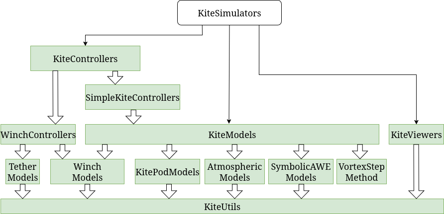

```@meta
CurrentModule = SymbolicAWEModels
```

# SymbolicAWEModels
Documentation for the package [SymbolicAWEModels](https://github.com/OpenSourceAWE/SymbolicAWEModels.jl).

This package provides modular symbolic models of Airborne Wind Energy (AWE) systems, 
which consist of a wing, one or more tethers, one or more winches and a bridle system with or without pulleys.
The kite is modeled as a deforming rigid body with orientation governed by quaternion dynamics. The aerodynamic forces and moments are computed using the Vortex Step Method. The tether is modeled as point masses connected by spring-damper elements, with aerodynamic drag modeled realistically. 
The winch is modeled as a motor/generator that can reel in or out the tethers.

The [`SymbolicAWEModel`](@ref) has the following subcomponents, implemented in separate packages:
- AtmosphericModel from [AtmosphericModels](https://github.com/aenarete/AtmosphericModels.jl)
- WinchModel from [WinchModels](https://github.com/aenarete/WinchModels.jl) 
- The aerodynamic forces and moments of some of the models are calculated using the package [VortexStepMethod](https://github.com/Albatross-Kite-Transport/VortexStepMethod.jl)

This package is part of [`KiteModels`](https://github.com/ufechner7/KiteModels.jl),
which in turn is part of the Julia Kite Power Tools, which consist of the following packages:



## Installation
Install [Julia 1.11](https://OpenSourceAWE.github.io/2024/08/09/installing-julia-with-juliaup.html), if you haven't already. On Linux, make sure that Python3 and Matplotlib are installed:
```
sudo apt install python3-matplotlib
```
Before installing this software it is suggested to create a new project, for example like this:
```bash
mkdir test
cd test
julia --project="."
```
Then add SymbolicAWEModels from  Julia's package manager, by typing:
```julia
using Pkg
pkg"add SymbolicAWEModels"
``` 
at the Julia prompt. You can run the unit tests with the command (careful, can take 60 min):
```julia
pkg"test SymbolicAWEModels"
```
You can copy the examples to your project with:
```julia
using SymbolicAWEModels
SymbolicAWEModels.install_examples()
```
This also adds the extra packages, needed for the examples to the project. Furthermore, it creates a folder `data`
with some example input files. You can now run the examples with the command:
```julia
include("examples/menu.jl")
```
You can also run the ram-air-kite example like this:
```julia
include("examples/ram_air_kite.jl")
```
This might take two minutes. To speed up the model initialization, you can create a system image:
```bash
cd bin
./create_sys_image
```
If you now launch Julia with `./bin/run_julia` and then run the above example again, it should be about three
times faster.

## Ram air kite model
This model represents the kite as a deforming rigid body, with orientation governed by quaternion dynamics. Aerodynamics are computed using the Vortex Step Method. The kite is controlled from the ground via four tethers.

## Tether
The tether is modeled as point masses, connected by spring-damper elements. Aerodynamic drag is modeled realistically. When reeling out or in the unstreched length of the spring-damper elements
is varied. This does not translate into physics directly, but it avoids adding point masses at run-time, which would be even worse because it would introduce discontinuities. When using
Dyneema or similar high-strength materials for the tether the resulting system is very stiff which is a challenge for the solver.

## Reference frames and control inputs
- a positive `set_torque` will accelerate the reel-out, a negative `set_torque` counteract the pulling force of the kite. The unit is [N/m] as seen at the motor/generator axis.
- the `depower` settings are dimensionless and can be between zero and one. A value equal to $\mathrm{depower\_zero}/100$ from the `settings.yaml` file means that the kite is fully powered. 
- the `heading` angle, the direction the nose of the kite is pointing to is positive in clockwise direction when seen from above.
- the `steering` input, dimensionless and in the range of -1.0 .. 1.0. A positive steering input causes a positive turn rate (derivative of the heading).

A definition of the reference frames can be found [here](https://OpenSourceAWE.github.io/KiteUtils.jl/dev/reference_frames/) .

## Further reading

## See also
- [Research Fechner](https://research.tudelft.nl/en/publications/?search=Fechner+wind&pageSize=50&ordering=rating&descending=true) for the scientic background of the winches and tethers.
- More kite models [KiteModels](https://github.com/OpenSourceAWE/KiteModels.jl)
- The meta-package [KiteSimulators](https://github.com/aenarete/KiteSimulators.jl)
- the package [KiteUtils](https://github.com/OpenSourceAWE/KiteUtils.jl)
- the packages [WinchModels](https://github.com/aenarete/WinchModels.jl) and [KitePodModels](https://github.com/aenarete/KitePodModels.jl) and [AtmosphericModels](https://github.com/aenarete/AtmosphericModels.jl)
- the packages [KiteControllers](https://github.com/aenarete/KiteControllers.jl) and [KiteViewers](https://github.com/aenarete/KiteViewers.jl)
- the [VortexStepMethod](https://github.com/Albatross-Kite-Transport/VortexStepMethod.jl)

Authors: Bart van de Lint (bart@vandelint.net), Uwe Fechner (uwe.fechner.msc@gmail.com)
