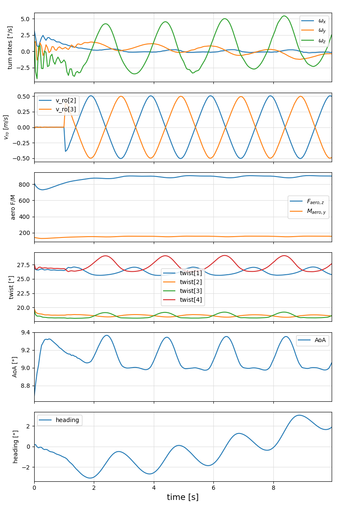

```@meta
CurrentModule = SymbolicAWEModels
```
# Examples for using the ram air kite model

## Create a test project
```bash
mkdir test
cd test
julia --project=.
```
Don't forget to type the dot at the end of the last line.
With the last command, we told Julia to create a new project in the current directory.

You can copy the examples to your project with:
```julia
using SymbolicAWEModels
SymbolicAWEModels.install_examples()
```

## Running the first example
```julia
SIMPLE=false; include("examples/ram_air_kite.jl")
```
Expected output for first run:
```
[ Info: Loading packages 
Time elapsed: 7.483472342 s
[ Info: Creating wing, aero, vsm_solver, sys_struct and s:
Time elapsed: 15.341197455 s
[ Info: Creating ODESystem
  4.316010 seconds (8.72 M allocations: 222.606 MiB, 1.42% gc time, 25.46% compilation time: 14% of which was recompilation)
[ Info: Simplifying the system
 38.520311 seconds (335.98 M allocations: 11.256 GiB, 3.30% gc time, 26.34% compilation time: 29% of which was recompilation)
[ Info: Creating ODEProblem
 79.285815 seconds (668.64 M allocations: 22.706 GiB, 3.52% gc time, 19.17% compilation time: 19% of which was recompilation)
[ Info: Initialized integrator in 20.055285573 seconds
[ Info: System initialized at:
Time elapsed: 184.100123328 s
[ Info: Total time without plotting:
Time elapsed: 201.450775931 s
┌ Info: Performance:
│   times_realtime = 5.425567300328113
└   integrator_times_realtime = 17.86788617896347
```
The second time it runs much faster, because the simplified ODE system is cached in the `prob_dynamic_1.11_3_seg.bin`
file in the `data` folder:
```
[ Info: Loading packages 
Time elapsed: 7.396961284 s
[ Info: Creating wing, aero, vsm_solver, sys_struct and s:
Time elapsed: 15.387790726 s
[ Info: Initialized integrator in 29.545349428 seconds
[ Info: System initialized at:
Time elapsed: 57.134361795 s
[ Info: Total time without plotting:
Time elapsed: 75.475794933 s
┌ Info: Performance:
│   times_realtime = 5.038873691119553
└   integrator_times_realtime = 16.40954043592023
```
You can save another 45s when checking out the code with git, create a system image and run the example from the checked out repository.

In this example, the kite is first parked, and then a sinus-shaped steering input is applied such that is dancing
in the sky.


## Running the second example
```julia
SIMPLE=true; include("examples/ram_air_kite.jl")
```
The simple model has a very simple bridle system without pulleys and with less attachment points on the wing. 
While the default model has a [speed system](https://kiteboarding.com/proddetail.asp?prod=ozone-r1v4-pro-tune-speedsystem-complete) with pulleys and more attachment points on the wing.



## Linearization
The following example creates a nonlinear system model, finds a steady-state operating point, linearizes the model 
around this operating point and compares the simulation results of the non-linear and linearized system:
```julia
include("examples/lin_ram_model.jl")
```
See: [`lin_ram_model.jl`](https://github.com/OpenSourceAWE/SymbolicAWEModels.jl/blob/main/examples/lin_ram_model.jl)

## How to create a SymbolicAWEModel
The following code is a minimal example that shows how to create a ram air kite struct:
```julia
using SymbolicAWEModels

# Initialize model
set = load_settings("system_ram.yaml")

sam = SymbolicAWEModel(set)
```
